# Homelab Platform

## Platform overview

This repository defines a GitOps-driven homelab platform that brings together:

- **Backstage catalog** for service discovery and documentation.
- **Argo CD GitOps** for continuous reconciliation of Kubernetes workloads.
- **Terraform + Talos** for infrastructure provisioning and cluster lifecycle.

High-level flow:

```
Terraform ──► Talos cluster ──► Argo CD bootstrap ──► Root apps ──► Workloads
        └──────────────────────────────► Backstage catalog ◄────────────┘
```

## Prerequisites

Before bootstrapping, ensure you have:

- **Cluster access** (kubeconfig with admin permissions).
- **DNS** records for cluster ingress endpoints and internal services.
- **Secrets management** in place (e.g., external secrets, SOPS, or a vault),
  because Argo CD and workloads expect pre-provisioned secrets.

## Bootstrap sequence

1. **Provision infrastructure and Talos** (see `terraform/` and `talos/`).

2. **Install/Bootstrap Argo CD**:

   ```bash
   ./argocd/bootstrap.sh
   ```

3. **Apply root apps** (the Argo CD app-of-apps pattern):

   ```bash
   kubectl apply -f argocd/root-apps/
   ```

4. **Wait for Argo CD to sync** and verify all apps are healthy.

## Repository layout

- `argocd/` — Argo CD manifests, bootstrap, and app definitions.
  - `root-apps/` — Root apps split into `services/` and `tools/`.
  - `applications/` — Individual `Application` resources.
  - `applicationsets/` — `ApplicationSet` resources for dynamic app generation.
- `terraform/` — Infrastructure as code for underlying resources.
- `talos/` — Talos cluster configuration and lifecycle artifacts.
- `backstage/` — Backstage catalog configuration and metadata.

## Adding a new service

1. **Create an Argo CD application** under `argocd/applications/` or
   `argocd/applicationsets/`, then reference it from the appropriate
   root app under `argocd/root-apps/services/` or `argocd/root-apps/tools/`.
2. **Define Backstage metadata** by adding a new entity to the catalog
   (typically in `backstage/` or referenced by `catalog-info.yaml`).
3. **Commit and push** so Argo CD can reconcile and Backstage can ingest
   the new entity.


## Network Architecture

The homelab uses Cilium Gateway API with Cloudflare Tunnel for secure external access:

```mermaid
flowchart LR

%% ================= INTERNET =================
subgraph INTERNET["Internet"]
    USER["User Browser<br/>https://dog.horacio.cloud"]
end

%% ================= CLOUDFLARE =================
subgraph CF["Cloudflare Edge"]
    CF_DNS["DNS"]
    CF_TUNNEL["Cloudflare Tunnel<br/>*.horacio.cloud → cilium-gateway"]
end

%% ================= HOME =================
subgraph HOME["Home Network 192.168.1.0/24"]

    subgraph K8S["Kubernetes (Talos)"]

        subgraph NS_CF["cloudflare-tunnel ns"]
            CLOUDFLARED["cloudflared<br/>tunnel agent"]
        end

        subgraph NS_SYS["kube-system ns"]
            GATEWAY["Cilium Gateway<br/>192.168.1.148<br/>80/443"]
            CILIUM["Cilium eBPF<br/>LB + L2 announce"]
        end

        subgraph NS_APP["dog-page ns"]
            HTTPROUTE["HTTPRoute<br/>dog.horacio.cloud"]
            SVC["Service<br/>dog-page:80"]
            POD["Pod<br/>dog-page"]
        end

    end
end

%% ================= FLOW =================
USER -->|HTTPS| CF_DNS --> CF_TUNNEL -->|tunnel| CLOUDFLARED -->|HTTP| GATEWAY --> CILIUM --> HTTPROUTE --> SVC --> POD
```



**Key components:**
- **Cloudflare Tunnel**: Provides secure ingress without port forwarding (outbound connection only)
- **Cilium Gateway API**: eBPF-based Kubernetes Gateway implementation with L2 announcements
- **HTTPRoute**: Kubernetes Gateway API resource for HTTP routing rules
